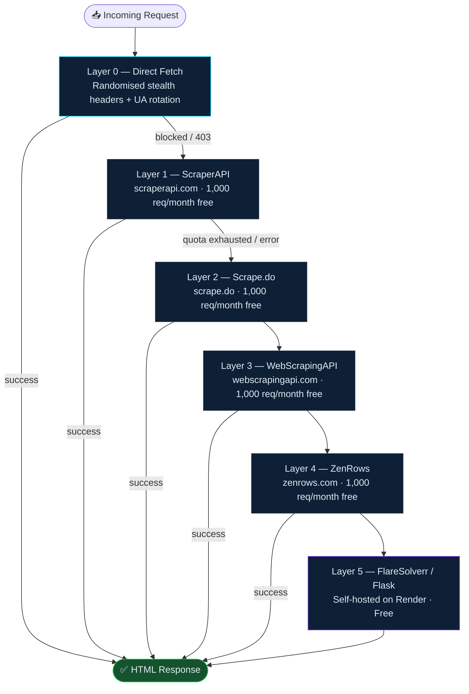
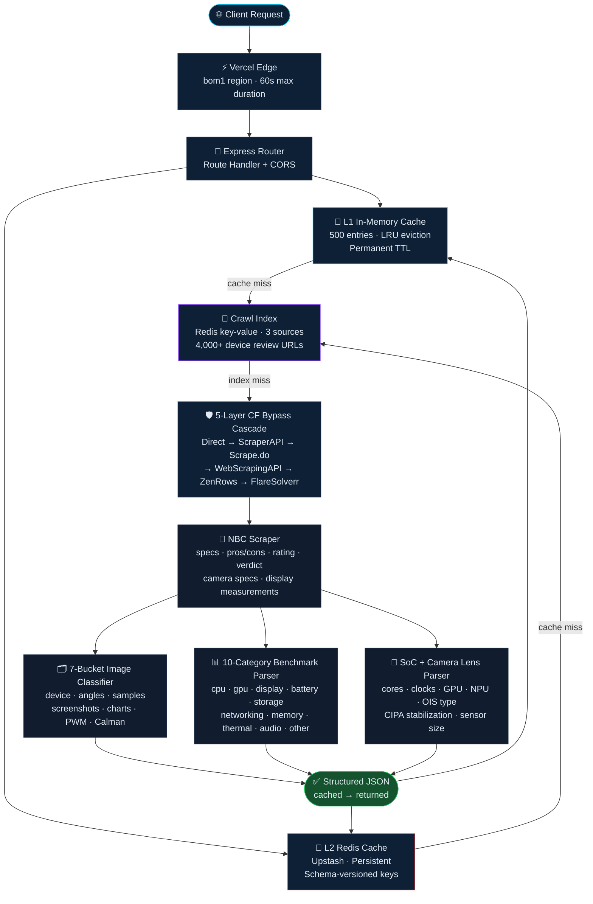

<div align="center">


# 📓 NotebookCheck Scraper API

### The only open-source API that turns NotebookCheck reviews into structured JSON — with Cloudflare bypass, 7-bucket image classification, full benchmarks, and a 4,000+ device crawl index.

[](./LICENSE)
[](https://www.typescriptlang.org/)
[](https://nodejs.org/)
[](https://expressjs.com/)
[](https://vercel.com/)
[](https://upstash.com/)
[](../../actions)

<br/>

[🚀 Deploy Now](#deploy-to-vercel) · [📖 API Reference](#api-reference) · [⚡ Quick Start](#quick-start) · [🏗 Architecture](#architecture) · [🐛 Report Bug](../../issues) · [💡 Request Feature](../../issues)

</div>

---

## Table of Contents

- [Why This API?](#why-this-api)
- [Features](#features)
- [Quick Start](#quick-start)
  - [Deploy to Vercel](#deploy-to-vercel)
- [Environment Variables](#environment-variables)
- [API Reference](#api-reference)
  - [Endpoint Overview](#endpoint-overview)
  - [`/api/phone` — Full device data ⭐](#apiphone--full-device-data-)
  - [`/api/processor` — SoC deep data](#apiprocessor--soc-deep-data)
  - [`/api/phone/suggestions` · `/api/nbc/suggestions`](#search--suggestions)
  - [`/api/nbc/device` · `/api/phone/device` — Scrape by URL](#scrape-by-url)
  - [Debug & Timing](#debug--timing)
  - [Crawl Index](#crawl-index)
  - [Browser Dashboards](#browser-dashboards)
  - [Error Schema](#error-schema)
- [Sample JSON Output](#sample-json-output)
- [Image Buckets](#image-buckets)
- [Benchmark Categories](#benchmark-categories)
- [Cloudflare Bypass Architecture](#cloudflare-bypass-architecture)
- [Caching](#caching)
- [Architecture](#architecture)
- [Project Structure](#project-structure)
- [Use Cases](#use-cases)
- [Performance](#performance)
- [Contributing](#contributing)
- [Roadmap](#roadmap)
- [Disclaimer](#%EF%B8%8F-disclaimer)
- [License](#license)

---

## Why This API?

NotebookCheck is the most thorough independent smartphone review site on the web — oscilloscope PWM measurements, Calman colour calibration plots, 10-category benchmark suites, per-lens camera specs with sensor sizes and OIS types, structured pros/cons, and hundreds of classified camera samples per review. No other site publishes this depth of data in a machine-readable form.

The problem: NotebookCheck sits behind Cloudflare WAF, serves everything as HTML, and changes its markup without notice. Getting that data out reliably requires solving three things at once:

1. **Cloudflare bypass** — datacenter IPs get 403'd. The API ships a 5-layer cascade that automatically fails over through ScraperAPI → Scrape.do → WebScrapingAPI → ZenRows → FlareSolverr with zero downtime.
2. **Image classification** — NBC review pages mix product shots, angle shots, camera samples, screenshots, benchmark charts, oscilloscope traces, and Calman plots in a single undifferentiated image pool. The API sorts them into 7 typed buckets using a multi-pass filename/caption/section-context classifier with 9 named fixes for real-world edge cases.
3. **Scale** — scraping live on every request doesn't work. The API maintains a Redis-backed crawl index of 4,000+ device review URLs across three independent NBC listing sources, so most requests resolve from index in milliseconds without a live scrape.

<div align="right"><a href="#table-of-contents">↑ back to top</a></div>

---

## Features

| Feature | This API | Most others |
|:---|:---:|:---:|
| 5-layer Cloudflare bypass cascade | ✅ | ❌ |
| 7-bucket image classification (device / angles / camera samples / screenshots / charts / display measurements / colour calibration) | ✅ | ❌ |
| 10-category benchmarks (CPU / GPU / memory / display / battery / storage / networking / thermal / audio / other) | ✅ | ❌ |
| Per-lens camera specs (sensor, size, aperture, OIS type, CIPA stabilization, zoom, AF) | ✅ | ❌ |
| Display deep data (brightness, contrast, ΔE, gamma, CCT, PWM frequency) | ✅ | ❌ |
| Processor / SoC deep data (cores, clocks, GPU, NPU, process node, memory type) | ✅ | ❌ |
| Smart variant-aware search (penalty scoring + hard-reject) | ✅ | ❌ |
| 3-source crawl index with 4,000+ device review URLs | ✅ | ❌ |
| Redis-backed two-layer cache with schema-versioned keys | ✅ | ❌ |
| Per-stage debug + timing endpoints | ✅ | ❌ |
| NBC TYPO3 POST search (direct, no SearXNG dependency) | ✅ | ❌ |
| GSMArena suggestions for autocomplete | ✅ | ❌ |
| Interactive browser dashboards (/migrate, /recover, /recrawl) | ✅ | ❌ |
| Fully CORS-enabled for direct frontend consumption | ✅ | ❌ |
| Serverless — no infrastructure to manage | ✅ | ❌ |

<div align="right"><a href="#table-of-contents">↑ back to top</a></div>

---

## Quick Start

**Prerequisites:** Node.js 18+ · npm

```bash
git clone https://github.com/Sanjeevu-Tarun/notebookchecker
cd notebookchecker
npm install
cp .env.example .env        # copy env template — fill in keys before first run
npm run dev
# → http://localhost:3000
```

> `npm run dev` starts a local Express server via `ts-node`. On Vercel, `module.exports = app` is used directly as the serverless handler — same codebase, zero config differences.

> **CORS:** The API is fully CORS-enabled out of the box. Hit any endpoint directly from a browser, a frontend app, or a mobile WebView — no proxy required.

### Deploy to Vercel

[](https://vercel.com/new/clone?repository-url=https://github.com/Sanjeevu-Tarun/notebookchecker)

Or via CLI:

```bash
npm install -g vercel
vercel deploy
```

`vercel.json` is pre-configured (60s max duration, `bom1` region). Zero extra setup required.

<div align="right"><a href="#table-of-contents">↑ back to top</a></div>

---

## Environment Variables

The API runs without any configuration — direct fetch with stealth headers is the zero-key fallback. Add keys to unlock more bypass resilience.

### Cloudflare Bypass

| Variable | Provider | Free Tier |
|:---|:---|:---:|
| `SCRAPERAPI_KEY` | [scraperapi.com](https://scraperapi.com) | 1,000 req/month |
| `SCRAPEDO_TOKEN` | [scrape.do](https://scrape.do) | 1,000 req/month |
| `WEBSCRAPINGAPI_KEY` | [webscrapingapi.com](https://webscrapingapi.com) | 1,000 req/month |
| `ZENROWS_KEY` | [zenrows.com](https://zenrows.com) | 1,000 req/month |
| `FLARESOLVERR_URL` | Self-hosted / Render | Free |

### Cache & Search

| Variable | Description |
|:---|:---|
| `UPSTASH_REDIS_REST_URL` | Upstash Redis REST endpoint |
| `UPSTASH_REDIS_REST_TOKEN` | Upstash Redis auth token |
| `SEARXNG_URL` | Your SearXNG instance URL (device search fallback) |

> Get free Redis at [console.upstash.com](https://console.upstash.com). Get a free SearXNG instance at [searxng-notebookcheck.onrender.com](https://searxng-notebookcheck.onrender.com) or self-host on Render's free tier.

<div align="right"><a href="#table-of-contents">↑ back to top</a></div>

---

## API Reference

### Endpoint Overview

| Method | Endpoint | Description |
|:---|:---|:---|
| `GET` | `/api/phone?q=` | ⭐ Full device data — specs + benchmarks + classified images |
| `GET` | `/api/processor?q=` | SoC deep data — cores, GPU, NPU, benchmarks with percentiles |
| `GET` | `/api/phone/suggestions?q=` | GSMArena-powered device autocomplete |
| `GET` | `/api/nbc/suggestions?q=` | NBC TYPO3 suggestions (2,000+ reviewed devices) |
| `GET` | `/api/nbc/device?url=` | Scrape any NBC review URL directly |
| `GET` | `/api/phone/device?url=` | Scrape any GSMArena device page directly |
| `GET` | `/api/phone/debug?q=` | Per-stage timing — which layer resolved the request |
| `GET` | `/api/nbc/direct-debug?q=` | Raw TYPO3 search results, scoring, and timing |
| `GET` | `/api/nbc/searxng-debug?q=` | SearXNG fallback debug |
| `GET` | `/api/processor/suggestions?q=` | SoC autocomplete suggestions |
| `GET` | `/api/processor/device?url=` | Scrape SoC from a specific NBC review page |
| `GET` | `/api/processor/debug?q=` | Per-stage SoC timing and candidate scoring |
| `GET` | `/api/index/crawl?maxPages=` | Crawl N pages across all three NBC sources |
| `GET` | `/api/index/status` | Coverage stats, queue breakdown, error count |

All endpoints accept `&nocache=1` to bypass both cache layers and force a fresh scrape.

---

### `/api/phone` — Full device data ⭐

The primary endpoint. Resolution order: **full-result cache → Redis crawl index → live scrape**. Returns the complete device object: review metadata, specs, rating, verdict, pros/cons, cameras, display deep data, benchmarks, and classified images.

```bash
GET /api/phone?q=vivo+x300+pro
GET /api/phone?q=samsung+galaxy+s25+ultra&nocache=1
```

**Query Parameters**

| Parameter | Required | Description |
|:---|:---:|:---|
| `q` | Yes | Device name (URL-encoded) |
| `nocache` | No | Set to `1` to bypass all cache layers and re-scrape live |

> Search uses a **penalty scoring + hard-reject system** — querying `s25` won't return `s25+` or `s25 ultra` unless explicitly asked. Model suffix words (`xl`, `xr`, `se`, `5g`, `4g`, `go`, `compact`, `slim`, `zoom`, `plus`, `fold`, `flip`, `ultra`) are treated as hard discriminators: a result that has one and the query doesn't (or vice versa) is hard-rejected rather than just penalised.

**Response shape:**

```jsonc
{
  "success": true,
  "source": "full-cache",   // "full-cache" | "index" | "live" — which layer served this
  "data": {
    "title": "...",
    "rating": "88%",
    "ratingLabel": "very good",
    "verdict": "...",
    "author": "...",
    "publishDate": "...",
    "pros": ["..."],
    "cons": ["..."],
    "soc": "...",
    "gpu": "...",
    "ram": "...",
    "display": { "technology": "AMOLED", "ΔE ColorChecker": "1.3", "PWM frequency": "360 Hz", ... },
    "cameras": { "lenses": [...], "selfie": {...}, "videoCapabilities": "..." },
    "images": {
      "device": [...],
      "deviceAngles": [...],
      "cameraSamples": [...],
      "screenshots": [...],
      "charts": [...],
      "displayMeasurements": [...],
      "colorCalibration": [...]
    },
    "benchmarks": {
      "cpu": [{ "name": "Geekbench 6.5 / Single-Core", "value": "3562", "unit": "Points" }],
      "gpu": [...],
      "display": [...],
      "battery": [...],
      "storage": [...],
      "networking": [...],
      "memory": [...],
      "thermal": [...],
      "audio": [...],
      "other": [...]
    }
  }
}
```

---

### `/api/processor` — SoC deep data

Deep SoC data including CPU core clusters, clocks, GPU, NPU, connectivity, process node, and memory type — plus per-benchmark scores with percentile rankings and per-device score breakdowns showing exactly which phones were tested with this chip.

```bash
GET /api/processor?q=snapdragon+8+elite
GET /api/processor?q=dimensity+9400
```

| Endpoint | Description |
|:---|:---|
| `GET /api/processor?q=<chip>` | Full processor data by name |
| `GET /api/processor/suggestions?q=<chip>` | Autocomplete suggestions |
| `GET /api/processor/device?url=<nbc-url>` | Scrape SoC from a specific NBC review page |
| `GET /api/processor/debug?q=<chip>` | Per-stage timing and candidate scoring |
| `GET /api/processor/search?q=<chip>` | Raw search results before scoring |

<details>
<summary><strong>▶ Expand full Snapdragon 8 Elite JSON response</strong></summary>

```json
{
  "success": true,
  "source": "notebookcheck",
  "data": {
    "name": "Qualcomm Snapdragon 8 Elite",
    "manufacturer": "Qualcomm",
    "performanceTier": "Flagship",
    "processNode": "3 nm",
    "totalCores": 8,
    "boostClockMHz": 4300,
    "cpuClusters": [
      { "name": "Qualcomm Oryon Gen 2 Prime", "count": 2, "baseClockMHz": 4300, "isPerformanceCore": true },
      { "name": "Qualcomm Oryon Gen 2 Performance", "count": 6, "baseClockMHz": 3500, "isPerformanceCore": true }
    ],
    "gpu": { "name": "Qualcomm Adreno 830", "maxClockMHz": 1100 },
    "npu": { "name": "Hexagon" },
    "memory": { "type": "LPDDR5X", "speedMHz": "4800 MHz" },
    "connectivity": { "wifi": "Wi-Fi 7", "cellular": "X80 5G Modem" },
    "benchmarks": [
      {
        "name": "Geekbench 6.6 Single-Core",
        "value": "3047",
        "unit": "points",
        "category": "cpu",
        "minValue": "2309",
        "maxValue": "3228",
        "percentile": "71",
        "deviceScores": [
          { "model": "Xiaomi Poco F7 Ultra", "score": "2309" },
          { "model": "OnePlus 13", "score": "3087" },
          { "model": "Asus ROG Phone 9 Pro", "score": "3215" }
        ]
      }
    ],
    "devicesUsing": [
      { "name": "Xiaomi 15", "url": "https://www.notebookcheck.net/..." },
      { "name": "OnePlus 13", "url": "https://www.notebookcheck.net/..." }
    ]
  }
}
```

</details>

---

### Search & Suggestions

```bash
# GSMArena-powered device autocomplete (returns name + image URL)
GET /api/phone/suggestions?q=vivo+x300

# NBC suggestions via TYPO3 POST search (2,000+ reviewed devices)
GET /api/nbc/suggestions?q=vivo+x300
```

---

### Scrape by URL

```bash
# Scrape any NBC review URL directly — bypasses search entirely
GET /api/nbc/device?url=https://www.notebookcheck.net/Vivo-X300-Pro-review.1184298.0.html

# Scrape any GSMArena device page directly
GET /api/phone/device?url=https://www.gsmarena.com/vivo_x300_pro-12345.php
```

---

### Debug & Timing

```bash
# Per-stage timing — which layer resolved the request and how long each took
GET /api/phone/debug?q=vivo+x300+pro

# Raw TYPO3 search results, scoring, and timing
GET /api/nbc/direct-debug?q=vivo+x300+pro

# SearXNG fallback debug — raw links, scores, winning candidate
GET /api/nbc/searxng-debug?q=vivo+x300+pro
```

**Sample debug response:**

```json
{
  "query": "vivo x300 pro",
  "source": "index",
  "totalMs": 312,
  "timing": { "indexSearchMs": 14, "indexScrapeMs": 298 },
  "cached": false,
  "result": {
    "title": "Vivo X300 Pro",
    "rating": "88%",
    "imageCounts": {
      "device": 12, "deviceAngles": 4, "cameraSamples": 5,
      "screenshots": 16, "charts": 6, "displayMeasurements": 8, "colorCalibration": 5
    }
  }
}
```

---

### Crawl Index

The crawl index pre-fetches device review URLs from three independent NBC listing sources into Redis. Once seeded, `/api/phone` lookups resolve from index in milliseconds — no live scraping on each request.

**Three crawl sources:**

| Source | Endpoint | Coverage |
|:---|:---|:---|
| A — NBC Reviews listing | `GET /api/index/crawl-reviews-page?page=N` | All reviewed smartphones (~80 pages) |
| B — NBC Chronological library | `GET /api/index/crawl-page?page=N` | Broader device library including older phones |
| C — NBC Smartphone listing | `GET /api/index/crawl-smartphone-page?page=N` | Current smartphone catalogue |

**Index management endpoints:**

| Endpoint | Description |
|:---|:---|
| `GET /api/index/crawl?maxPages=20` | Crawl N pages across all three sources |
| `GET /api/index/status` | Coverage stats, queue breakdown, error count |
| `GET /api/index/list?status=pending&limit=20` | Browse indexed entries by status |
| `GET /api/index/validate?count=10` | Verify N random index URLs are still valid |
| `GET /api/index/scrape-one?url=<url>` | Scrape and cache one specific indexed device |
| `GET /api/index/search-debug?q=<device>` | Verify index hit/miss for a query |
| `GET /api/index/errors` | List entries that failed scraping |
| `GET /api/index/reset-errors` | Re-queue all errored entries for retry |
| `GET /api/index/brands` | Brand breakdown of the current index |
| `GET /api/index/rebuild-search` | Rebuild the fast in-memory search index from Redis |
| `GET /api/index/resolve-url?url=<url>` | Debug: resolve a library URL to its review URL |
| `GET /api/index/swap-all` | Swap all library URLs that have a cached review URL |
| `GET /api/index/purge-library-duplicates` | Remove library entries superseded by review URLs |
| `GET /api/index/migrate-review-urls` | Resumable batch migration (library → review URLs) |
| `GET /api/index/clear` | ⚠️ Clear the entire crawl index |

```bash
curl https://YOUR-DEPLOYMENT.vercel.app/api/index/status
```

```json
{
  "total": 4821,
  "scraped": 3104,
  "pending": 1717,
  "errors": 0,
  "coverage": "64.4%"
}
```

> **Recommended setup:** Run `/api/index/crawl?maxPages=20` once after deployment to seed the index. Use [UptimeRobot](https://uptimerobot.com) (free) to ping `/api/nbc/keepalive` every 10 minutes to keep a SearXNG instance warm on Render's free tier.

---

### Browser Dashboards

The API ships three self-contained HTML dashboards for index management — no external tools needed. Each is a live, reactive UI with real-time progress bars, status indicators, and one-click pipeline controls.

| Route | Description |
|:---|:---|
| `/migrate` | Self-running batch migration: library URLs → review URLs, with live progress bars and auto-resume |
| `/recover` | Re-crawls all chronological pages, resolves library URLs, purges duplicates in sequence |
| `/recrawl` | Full reset pipeline: flush Redis → crawl Source A → crawl Source B → purge dupes → rebuild index |

---

### Error Schema

Every failure returns a consistent envelope. `success` is always `false` on error.

```json
{
  "success": false,
  "error": "Device not found",
  "code": "NOT_FOUND",
  "query": "vivo x999 ultra",
  "source": null,
  "durationMs": 142
}
```

| Field | Type | Description |
|:---|:---|:---|
| `success` | `false` | Always `false` on error — your primary branch condition |
| `error` | `string` | Human-readable error message |
| `code` | `string` | Machine-readable: `NOT_FOUND` · `SCRAPE_FAILED` · `RATE_LIMITED` · `INVALID_QUERY` |
| `query` | `string \| null` | The original query string, if one was provided |
| `source` | `null` | Always `null` on error |
| `durationMs` | `number` | Total request time in milliseconds — useful for timeout debugging |

HTTP status codes map predictably: `400` for invalid/missing parameters, `404` for device not found, `429` for upstream proxy quota exhaustion, `500` for scraper or parse failures.

<div align="right"><a href="#table-of-contents">↑ back to top</a></div>

---

## Sample JSON Output

Real output from the API for the **Vivo X300 Pro**. Not mocked — not fabricated.

<details>
<summary><strong>▶ Expand full Vivo X300 Pro JSON response</strong></summary>

```json
{
  "success": true,
  "source": "full-cache",
  "data": {
    "title": "More than just an unusual camera setup - Vivo X300 Pro review",
    "subtitle": "Champion with potential.",
    "rating": "88%",
    "ratingLabel": "very good",
    "verdict": "The Vivo X300 Pro is a flagship camera smartphone with virtually uncompromising features, aimed primarily at photo and video enthusiasts.",
    "author": "Daniel Schmidt - Managing Editor Mobile - 857 articles published on Notebookcheck since 2013",
    "publishDate": "2025-12-14 15:26",
    "pros": ["powerful camera setup", "bright and accurate LTPO panel", "high performance", "IP69 certified", "fast charging", "36-month warranty"],
    "cons": ["no UWB", "average speakers", "throttling", "no barometer"],
    "soc": "MediaTek Dimensity 9500 8c/8t, 1 x 4.2 GHz ARM C1-Ultra, 3 x 3.5 GHz ARM C1-Premium, 4 x 2.7 GHz ARM C1-Pro",
    "gpu": "Arm Mali G1-Ultra MC12",
    "ram": "16 GB",
    "storage_capacity": "512 GB",
    "storage_type": "UFS 4.1",
    "os": "Android 16",
    "price": "€1399",
    "ipRating": "IP68/IP69",
    "bluetooth": "6.0",
    "wifi": "a/b/g/n/ac/ax/be",
    "maxChargingSpeed": "90 W",
    "warrantyMonths": "36",

    "display": {
      "technology": "AMOLED",
      "sizeInch": "6.78",
      "ppi": "453",
      "refreshRate": "120 Hz",
      "Brightness center (cd/m²)": "1609",
      "Contrast": "∞:1 (Black: 0 cd/m²)",
      "ΔE ColorChecker": "1.3",
      "sRGB coverage": "99.7",
      "Gamma": "2.26",
      "CCT (K)": "6709",
      "PWM frequency": "360 Hz"
    },

    "cameras": {
      "lenses": [
        {
          "type": "main",
          "megapixels": "50 MP",
          "sensor": "LYT-828",
          "sensorSize": "1/1.28\"",
          "aperture": "f/1.57",
          "ois": true,
          "oisType": "Gimbal-OIS",
          "cipaStabilization": "5.5"
        },
        {
          "type": "telephoto",
          "megapixels": "200 MP",
          "sensorSize": "1/1.4\"",
          "aperture": "f/2.7",
          "opticalZoom": "3.7x",
          "ois": true
        }
      ],
      "videoCapabilities": "8K@30fps, 4K@120fps"
    },

    "images": {
      "device": ["https://www.notebookcheck.net/.../aPic_Vivo_X300_Pro-0002.jpg"],
      "deviceAngles": ["https://www.notebookcheck.net/.../aPic_Vivo_X300_Pro-1774.jpg"],
      "cameraSamples": ["https://www.notebookcheck.net/.../Photo_X300Pro_Rabbit.jpg"],
      "screenshots": ["https://www.notebookcheck.net/.../_processed_/webp/.../Screenshot_20251209_105458.webp"],
      "charts": ["https://www.notebookcheck.net/.../GNSS_Vivo_X300_Pro_Lake.jpg"],
      "displayMeasurements": ["https://www.notebookcheck.net/.../RigolDS14.jpg"],
      "colorCalibration": ["https://www.notebookcheck.net/.../Calman_Natural_Standard_Grayscale_sRGB.jpg"]
    },

    "benchmarks": {
      "cpu": [
        { "name": "Geekbench 6.5 / Single-Core",   "value": "3562",    "unit": "Points" },
        { "name": "Geekbench 6.5 / Multi-Core",     "value": "10615",   "unit": "Points" },
        { "name": "Antutu v10 - Total Score",        "value": "3095982", "unit": "Points" }
      ],
      "gpu": [
        { "name": "3DMark / Wild Life Extreme",      "value": "7582",    "unit": "Points" },
        { "name": "3DMark / Solar Bay Score",        "value": "14869",   "unit": "Points" }
      ],
      "display": [
        { "name": "Display / APL18 Peak Brightness", "value": "2329",    "unit": "cd/m²" },
        { "name": "Screen flickering / PWM detected","value": "360 Hz Amplitude: 14.29 %", "unit": "%" }
      ],
      "battery": [
        { "name": "Battery runtime - WiFi v1.3",     "value": "17.9",    "unit": "h" },
        { "name": "Battery runtime - Reader / Idle", "value": "39.8",    "unit": "h" }
      ],
      "storage": [
        { "name": "Sequential Read 256KB (MB/s)",    "value": "2041.82", "unit": "" },
        { "name": "Sequential Write 256KB (MB/s)",   "value": "1981.85", "unit": "" }
      ],
      "networking": [
        { "name": "iperf3 transmit AXE11000 6GHz",   "value": "1866",    "unit": "MBit/s" }
      ]
    }
  }
}
```

> The snippet above is abbreviated. The full response includes 30+ GPU benchmark rows, 16 OS screenshots, 8 oscilloscope PWM waveforms (RigolDS12–RigolDS20), 5 Calman colour calibration plots, and 12 device photos correctly separated from 4 hardware angle shots — all from a single endpoint call.

</details>

<div align="right"><a href="#table-of-contents">↑ back to top</a></div>

---

## Image Buckets

Every device response includes an `images` object with content sorted into 7 typed buckets. Classification runs in three passes using filename patterns, section context, and caption analysis — not guesswork.

| Bucket | Contents |
|:---|:---|
| `device` | Hero product shots, colour variant photos |
| `deviceAngles` | Hardware detail shots — top, bottom, left, right, ports, buttons, SIM tray |
| `cameraSamples` | Photos **taken by** the phone — main / ultra-wide / tele / zoom / low-light / selfie / Portrait Studio |
| `screenshots` | OS and UI screenshots (Android, settings, apps) |
| `charts` | GNSS tracks, battery discharge plots, camera resolution charts |
| `displayMeasurements` | Oscilloscope PWM waveforms (`RigolDS*.jpg`), subpixel microscopy |
| `colorCalibration` | Calman colour accuracy plots, colour space coverage, greyscale charts |

The classifier has **9 named edge-case fixes** applied for real-world issues including:

- **`aPic_` naming** (Vivo X300 Pro — all shots share this prefix; correctly split across `device` / `deviceAngles` / `cameraSamples` by section context)
- **Large asset-ID heatmaps** (Xiaomi 17 Ultra)
- **Lender/partner logo leakage** from `/Notebooks/Leihsteller/`
- **Competitor device silhouettes** from NBC's `.nbcCI_zoom` size-comparison widget
- **`csm_*` processed thumbnails** — the only version of device shots NBC actually serves

<div align="right"><a href="#table-of-contents">↑ back to top</a></div>

---

## Benchmark Categories

Every device response includes a `benchmarks` object with results auto-categorised across 10 buckets. All categories are populated in the Vivo X300 Pro sample above with real NBC lab data.

| Category | Examples |
|:---|:---|
| `cpu` | Geekbench 6 Single/Multi, AnTuTu, PCMark Work, Geekbench AI NPU |
| `gpu` | 3DMark Wild Life Extreme, Solar Bay, Steel Nomad Light, GFXBench Aztec |
| `display` | APL18/HDR peak brightness (cd/m²), ΔE ColorChecker, PWM frequency, gamma, CCT |
| `battery` | WiFi runtime (h), reader/idle (h), load runtime (h) |
| `storage` | Sequential/random read-write (MB/s) |
| `networking` | iperf3 transmit/receive at 5 GHz and 6 GHz (MBit/s) |
| `memory` | RAM bandwidth tests |
| `thermal` | Max surface temperature (°C) |
| `audio` | Max volume (dB), frequency response |
| `other` | AI inference scores (UL Procyon, AImark), WebXPRT, anything else |

<div align="right"><a href="#table-of-contents">↑ back to top</a></div>

---

## Cloudflare Bypass Architecture

NotebookCheck uses Cloudflare WAF that blocks datacenter IPs. The cascade tries layers in order, skipping any layer whose key is not set.



Combined across all four free tiers: **~4,000 bypass requests per month**. You only need **one key** for this to work — unused layers are skipped gracefully. Sign up for all four for maximum resilience when quotas run out.

<div align="right"><a href="#table-of-contents">↑ back to top</a></div>

---

## Caching

| Layer | Storage | TTL | Behaviour |
|:---|:---|:---|:---|
| L1 | In-memory Map (500 entries, LRU eviction) | Permanent | Always checked first, zero latency |
| L2 | Redis via Upstash | Permanent (no EX) | Checked on memory miss, survives cold starts |

**Dual-layer strategy:** L1 (in-memory LRU, 500 entries) is always checked first. On a miss, L2 (Redis via Upstash) is checked next. Only on a full miss does the scraper run. Results are written to both layers simultaneously.

**Schema-versioned keys:** Cache keys follow the pattern `nbc:phone-full:v2:<device>`. A checksum of the `NBCDeviceData` field list is computed at startup — any change to the data shape auto-increments the cache key, instantly invalidating all stale data with no manual flush.

Every response includes a `source` field telling you exactly which layer served it:

| `source` value | Meaning |
|:---|:---|
| `full-cache` | Served from in-memory LRU — sub-millisecond, zero network cost |
| `redis` | Served from Upstash Redis — survives cold starts |
| `index` | Resolved from crawl index, then live-scraped and cached |
| `live` | Full cache miss — live scrape performed, result now written to both layers |

<div align="right"><a href="#table-of-contents">↑ back to top</a></div>

---

## Architecture



<div align="right"><a href="#table-of-contents">↑ back to top</a></div>

---

## Project Structure

```
├── index.ts                          # Express routes + Vercel handler + browser dashboards
├── vercel.json                       # 60s max duration · bom1 region · pre-configured
└── src/
    ├── flaresolverr.ts               # 5-layer Cloudflare bypass cascade
    ├── gsmarena.ts                   # GSMArena search + device scraper + suggestions
    ├── notebookcheck.ts              # Core NBC scraper — specs, benchmarks, 7-bucket image classifier, cameras
    ├── notebookcheck_index.ts        # Crawl index — 3-source Redis-backed URL store + in-memory search
    └── notebookcheck_processor.ts    # Processor / SoC scraper — cores, GPU, NPU, memory
```

<div align="right"><a href="#table-of-contents">↑ back to top</a></div>

---

## Use Cases

**Mobile comparison platforms**
Power side-by-side specs + benchmarks + camera lens data in one call. No database to maintain.
```bash
GET /api/phone?q=samsung+galaxy+s25+ultra
GET /api/phone?q=google+pixel+9+pro
```

**AI assistants & LLM tools**
Give your model clean, structured, up-to-date smartphone knowledge including real lab measurements (ΔE, PWM, runtime) via tool-calling or RAG.
```bash
GET /api/phone?q=iphone+16+pro+max   # structured JSON — ideal for LLM context
```

**Tech review sites**
Embed live specs, ratings, and benchmark numbers without scraping yourself.
```bash
GET /api/nbc/device?url=https://www.notebookcheck.net/Vivo-X300-Pro-review.1184298.0.html
```

**Research tools**
Analyse smartphone trends with actual measured display and battery data per device across generations.
```bash
GET /api/processor?q=snapdragon+8+elite   # percentile rankings across all tested devices
```

**Benchmark trackers**
Pull structured Geekbench / 3DMark / AnTuTu time-series for any reviewed phone.
```bash
GET /api/phone?q=oneplus+13   # benchmarks[] with name, value, unit for all 10 categories
```

<div align="right"><a href="#table-of-contents">↑ back to top</a></div>

---

## Performance

Typical response times under normal conditions:

| Scenario | Response Time |
|:---|:---|
| In-memory L1 hit (`source: "full-cache"`) | < 5 ms |
| Redis L2 hit (`source: "redis"`) | 10–40 ms |
| Crawl index hit + live scrape (`source: "index"`) | 300 ms–1.5 s |
| Full cache miss — live scrape | 1 s–4 s |

Cache misses are one-time costs. Subsequent requests for the same device are served from `full-cache` or `redis` permanently (no TTL). On Vercel's serverless infrastructure, the first request after a cold start falls back to Redis if the in-memory LRU was cleared, keeping response times acceptable even after inactivity.

<div align="right"><a href="#table-of-contents">↑ back to top</a></div>

---

## Contributing

Issues and PRs are welcome. For major changes, please open an issue first to discuss what you'd like to change.

**Getting set up:**

```bash
git clone https://github.com/Sanjeevu-Tarun/notebookchecker
cd notebookchecker
npm install
npm run dev
```

**Submitting a PR:**

```bash
git checkout -b feature/your-feature
git commit -m "feat: describe your change"   # follow Conventional Commits
git push origin feature/your-feature
# → open a pull request against main
```

**Code style:** TypeScript strict mode throughout. Keep scraper modules isolated — `notebookcheck.ts`, `notebookcheck_processor.ts`, and `gsmarena.ts` should have no cross-source dependencies inside parsers.

<div align="right"><a href="#table-of-contents">↑ back to top</a></div>

---

## Roadmap

- [ ] OpenAPI / Swagger spec auto-generated from route schemas
- [ ] `nocache` rate-limit guard (prevent scrape abuse on public deployments)
- [ ] Webhook support — notify on new device detection in the crawl index
- [ ] Response pagination for `/api/index/list` on large indexes
- [ ] GSMArena + NBC cross-reference endpoint (merge specs + benchmarks in one call)

Have an idea? [Open a feature request](../../issues).

<div align="right"><a href="#table-of-contents">↑ back to top</a></div>

---

## ⚠️ Disclaimer

This project scrapes publicly accessible pages for personal and educational use. It is not affiliated with, endorsed by, or connected to NotebookCheck or GSMArena in any way. Use responsibly, respect their Terms of Service, and do not use this API to build products that commercially reproduce their content at scale.

---

## License

[MIT](./LICENSE) © 2026 — Made with ❤️ by [Sanjeevu-Tarun](https://github.com/Sanjeevu-Tarun)

<!-- SEO: NotebookCheck API, NotebookCheck scraper, GSMArena API, phone review API, smartphone benchmark API, Cloudflare bypass scraper, image classification API, camera sample scraper, SoC scraper, processor data API, phone specs API, mobile review scraper, TypeScript scraper API, Vercel serverless API, Upstash Redis cache, NBC review scraper, benchmark extraction API, display calibration API, PWM measurement API, Calman plot API -->
